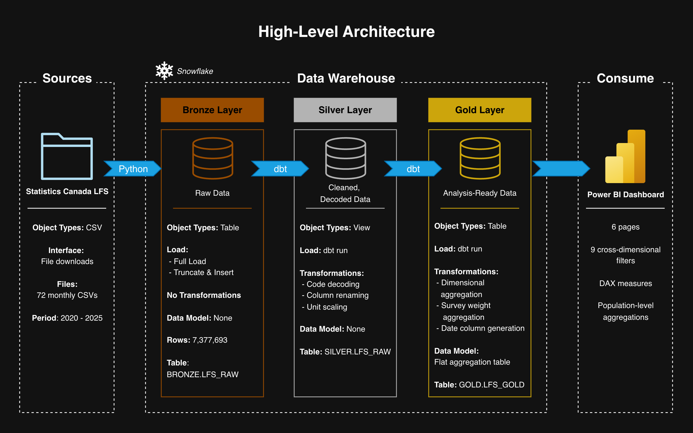
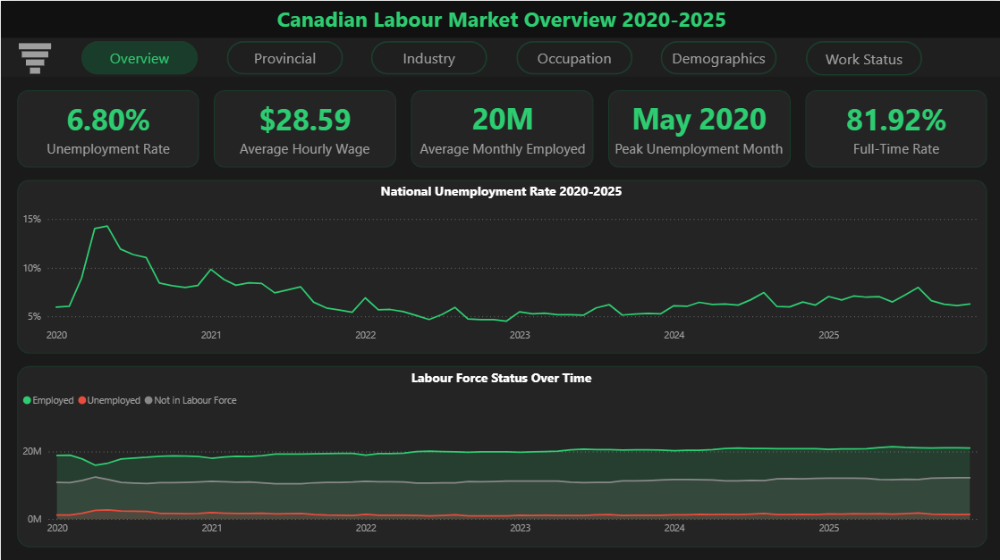
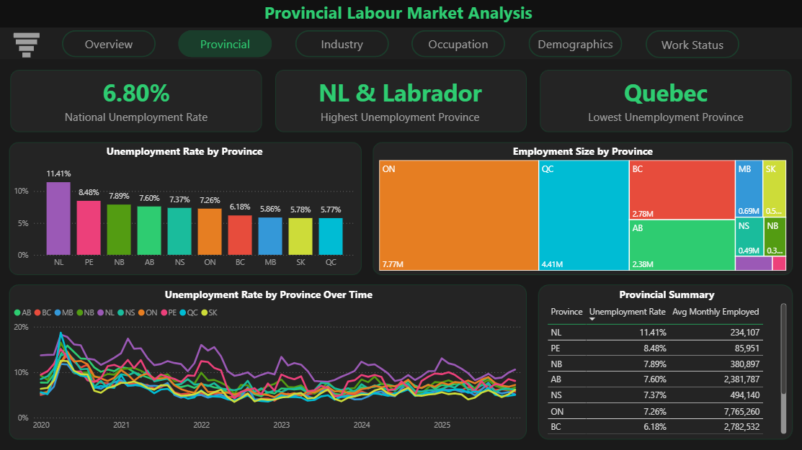
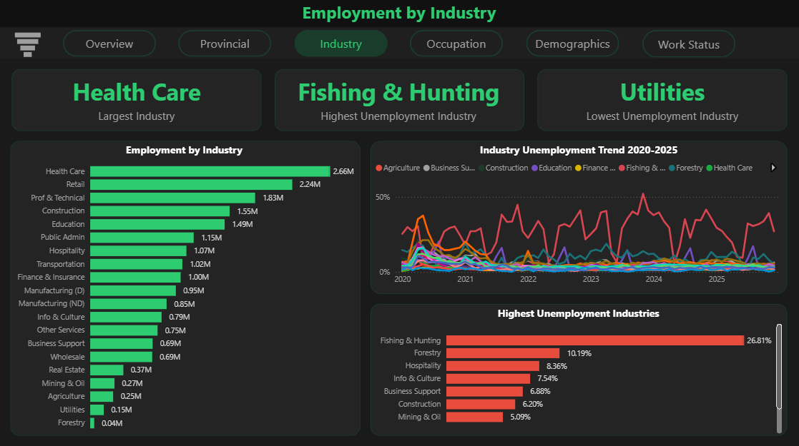
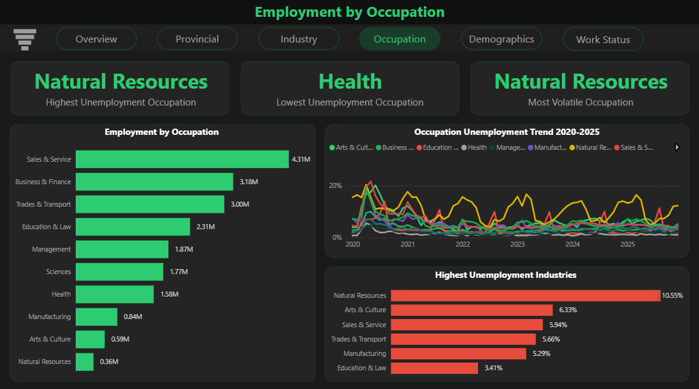
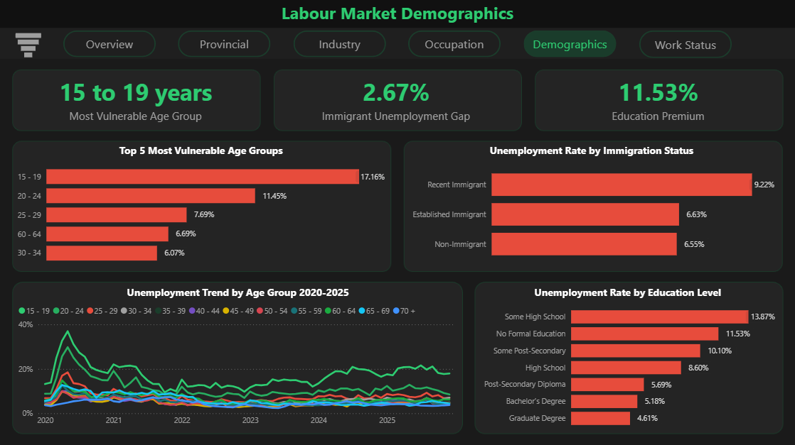
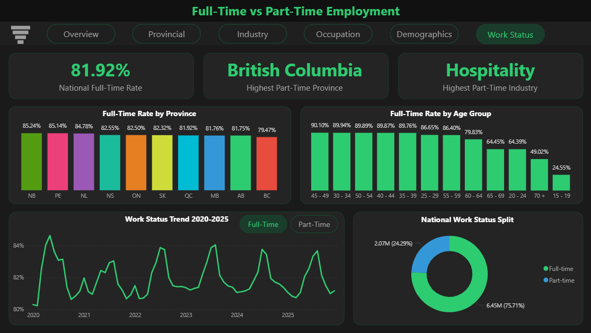

# Canadian Labour Analytics

A full-stack data engineering project analyzing the Canadian labour market from 2020 to 2025 using Statistics Canada's Labour Force Survey (LFS). The pipeline ingests 7.3 million survey records, transforms them through a medallion architecture in Snowflake using dbt, and delivers insights through a six-page Power BI dashboard.

**Business question:** How did the Canadian labour market evolve through 2020–2025, and which provinces, industries, and demographics were most affected?

---

## Architecture



---

## Tech Stack

| Layer | Tool |
|---|---|
| Ingestion | Python, pandas, snowflake-connector-python |
| Storage & Compute | Snowflake (Standard, AWS ca-central-1) |
| Transformation | dbt-snowflake 1.11 |
| Visualization | Power BI Desktop |

---

## Data Source

**Statistics Canada Labour Force Survey (LFS) — Public Use Microdata**
- 72 monthly CSV files, January 2020 to December 2025
- ~99,000–116,000 respondents per month
- 7,377,693 total rows ingested
- Each respondent carries a survey weight (`FINALWT`) representing how many Canadians they represent in the population

---

## Data Pipeline

### Bronze Layer - `CANADIAN_LABOUR.BRONZE.LFS_RAW`
Raw microdata loaded directly from Statistics Canada CSV files with no transformations. One row equals one survey respondent. All values are numeric codes as published by Stats Canada.

- 7,377,693 rows
- 26 columns selected from the original 60
- Loaded via Python using `write_pandas` from the Snowflake connector

### Silver Layer - `CANADIAN_LABOUR.SILVER.STG_LFS` (dbt view)
Cleaned and decoded version of the Bronze layer. Numeric codes are decoded into readable labels using CASE statements, and measures are scaled to their correct units.

- Province, gender, age group, marital status, education, immigrant status, labour force status, worker class, industry, and occupation columns decoded
- Hourly wage divided by 100 (stored in cents in raw data)
- Weekly hours divided by 10 (stored in tenths in raw data)
- Survey weight retained for population-level aggregations

### Gold Layer - `CANADIAN_LABOUR.GOLD.LFS_GOLD` (dbt table)
A single aggregated table grouping all key dimensions with survey-weighted metrics, designed for direct consumption by Power BI.

- Grouped by: survey year, month, province, gender, age group, education, immigrant status, labour force status, worker class, work status, industry, occupation
- Metrics: `total_weight`, `avg_hourly_wage`, `avg_weekly_hours`
- All Power BI measures use `total_weight` for population-level accuracy

---

## Dashboard

The Power BI dashboard has six pages, each answering a distinct analytical question. A collapsible filter panel provides cross-dimensional filtering by province, year, month, gender, age group, education, immigration status, industry, and occupation.

### Page 1 - National Overview
High-level view of the Canadian labour market from 2020 to 2025. The COVID-19 spike and subsequent recovery are clearly visible in the national unemployment trend.



### Page 2 - Provincial Analysis
Compares unemployment rates, employment size, and trends across all 10 provinces. Includes a ranked bar chart, employment treemap, trend lines, and a summary table.



### Page 3 - Industry
Breaks down employment size and unemployment rate across 21 industries. Identifies the most stable and most vulnerable sectors.



### Page 4 - Occupation
Analyzes unemployment rate and employment size across 10 occupation groups. Identifies the most volatile occupation using standard deviation of monthly unemployment rates.



### Page 5 - Demographics
Examines how unemployment varies by age group, education level, and immigration status. Reveals which Canadians face the greatest labour market vulnerability.



### Page 6 - Work Status
Analyzes full-time vs part-time employment by province, age group, and over time. Includes a bookmark toggle to switch between full-time and part-time trend views.



---

## Key Findings

- **COVID-19 peak:** National unemployment hit 14.29% in May 2020, more than double the 2025 rate of 6.80%, with recovery taking until mid-2022 to stabilize below 6%.

- **Provincial divide:** Newfoundland and Labrador has the highest unemployment rate at 11.41%, nearly double Quebec's 5.77%, reflecting persistent regional labour market disparities.

- **Industry vulnerability:** Fishing, hunting and trapping has an unemployment rate of 26.81% — nearly four times the national average — driven by seasonal employment patterns. Utilities is the most stable industry.

- **Education premium:** Unemployment drops from 13.87% for workers with some high school to 4.61% for graduate degree holders — a 9.26 percentage point gap — demonstrating a strong return on educational investment.

- **Youth precarity:** Workers aged 15–19 face a 17.16% unemployment rate and only 24.55% are employed full-time, reflecting the structural challenges facing young Canadians entering the labour market.

- **Immigrant gap:** Recent immigrants (landed 10 or fewer years ago) face 9.22% unemployment compared to 6.55% for non-immigrants — a 2.67 percentage point gap that narrows significantly for established immigrants at 6.63%.

---

## Project Structure

```
canadian-labour-analytics/
├── data/                   # Raw LFS CSV files (not committed)
├── ingestion/
│   └── ingest_lfs.py       # Python ingestion script
├── dbt_project/
│   ├── models/
│   │   ├── silver/
│   │   │   ├── sources.yml
│   │   │   └── stg_lfs.sql
│   │   └── gold/
│   │       └── lfs_gold.sql
│   ├── macros/
│   │   └── generate_schema_name.sql
│   └── dbt_project.yml
└── README.md
```

---

## How to Run

### Prerequisites
- Python 3.12
- Snowflake account
- dbt-snowflake (`pip install dbt-snowflake`)

### 1. Download LFS data
Download monthly LFS public use microdata files from [Statistics Canada](https://www150.statcan.gc.ca/n1/en/catalogue/71M0001X) and place them in the `data/` folder.

### 2. Configure Snowflake connection
Update credentials in `ingestion/ingest_lfs.py` and `~/.dbt/profiles.yml`. Use a `.env` file for credential management in production.

### 3. Set up Snowflake
Run the following in a Snowflake worksheet:
```sql
CREATE DATABASE CANADIAN_LABOUR;
CREATE SCHEMA CANADIAN_LABOUR.BRONZE;
CREATE SCHEMA CANADIAN_LABOUR.SILVER;
CREATE SCHEMA CANADIAN_LABOUR.GOLD;
CREATE WAREHOUSE LABOUR_WH WAREHOUSE_SIZE = 'X-SMALL' AUTO_SUSPEND = 60 AUTO_RESUME = TRUE;
CREATE TABLE CANADIAN_LABOUR.BRONZE.LFS_RAW (...);
```

### 4. Run ingestion
```bash
python3 ingestion/ingest_lfs.py
```

### 5. Run dbt
```bash
cd dbt_project
python3.12 -m dbt.cli.main run
```

### 6. Connect Power BI
Connect Power BI Desktop to Snowflake using the `GOLD.LFS_GOLD` table.

---
